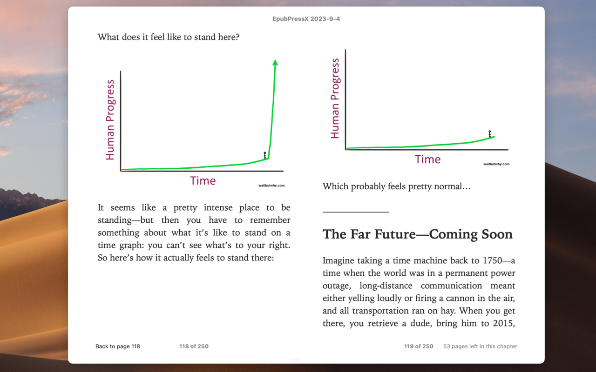

# EpubPressX
A Chrome extension that can convert web pages into epub e-books, compatible with WeChat Reading and others.

You can install it from the [Chrome Store](https://chrome.google.com/webstore/detail/epubpressx-read-the-web-o/akgkfegkiajbamekmkcafnfckmhgcnpa).

## Preview



## How it works
By packaging files into the epub format as required, an epub file becomes an e-book.

epub format structure

```
--ZIP Container--
mimetype
META-INF/
  container.xml
OEBPS/
  content.opf
  chapter1.xhtml
  ch1-pic.png
  css/
    style.css
    myfont.otf
```

packaging 

```sh
cd "folder of epub content"

# add mimetype 1st
zip -0 -X ../file.epub mimetype

# add the rest
zip -9 -X -r -u ../file.epub *
```

Reference 
[wikipedia](https://en.wikipedia.org/wiki/EPUB#Version_3.0.1),
[w3 standard](https://www.w3.org/TR/epub-33/)

## Fork source
Fork from https://github.com/haroldtreen/epub-press-clients

The epub files generated by the original project had display issues on WeChat Reading, so a fork was made and some updates were made:
- Faster and more stable: e-books are created locally, not dependent on the server
- Fixed EPUB format issues
- Fixed image positioning issues
- Can set the cover
- Can choose whether to include images