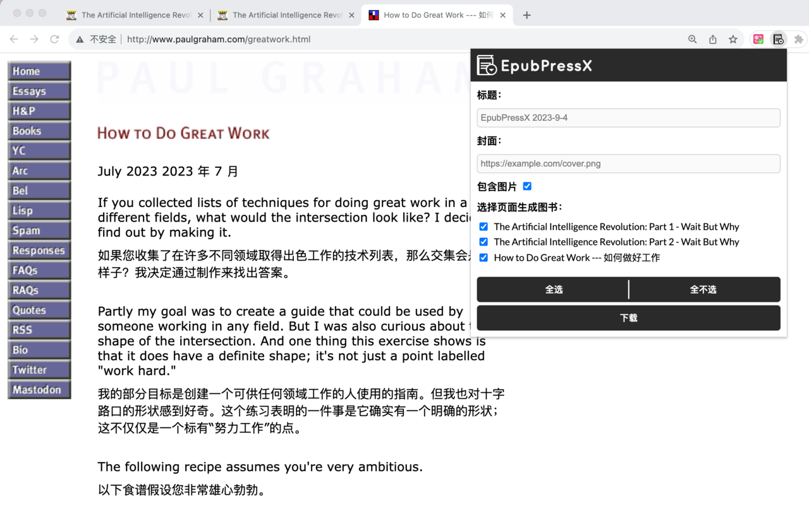
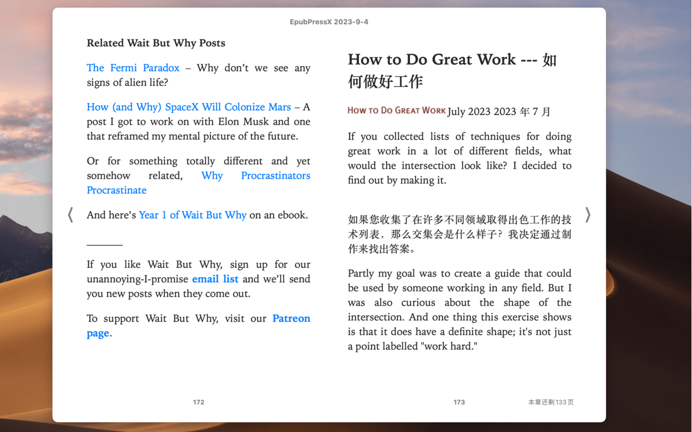

[English](README.en.md)

# EpubPressX
一个 chrome 插件，可以将网页制作成 epub 电子书，支持微信读书等。

可以通过 [chrome 商店](https://chrome.google.com/webstore/detail/epubpressx-read-the-web-o/akgkfegkiajbamekmkcafnfckmhgcnpa) 进行安装。

配合 [沉浸式翻译](https://chrome.google.com/webstore/detail/immersive-translate/bpoadfkcbjbfhfodiogcnhhhpibjhbnh)  插件可以制作双语电子书。

## 效果预览



## 原理
按照 epub 要求的格式，将文件打包成 epub 文件，就是一本电子书了。

epub 格式结构

```
--ZIP Container--
mimetype
META-INF/
  container.xml
OEBPS/
  content.opf
  chapter1.xhtml
  ch1-pic.png
  css/
    style.css
    myfont.otf
```

打包 

```sh
cd "folder of epub content"

# add mimetype 1st
zip -0 -X ../file.epub mimetype

# add the rest
zip -9 -X -r -u ../file.epub *
```

参考 
[wikipedia](https://en.wikipedia.org/wiki/EPUB#Version_3.0.1),
[w3 standard](https://www.w3.org/TR/epub-33/)

## Fork 来源
Fork from https://github.com/haroldtreen/epub-press-clients

原项目生成的 epub 文件在微信读书上显示有问题，所以 fork 了一份，并进行了一些更新：
- 更快更稳定：本地创建电子书，而不是依赖于服务器
- 修复了 EPUB 格式的问题
- 修复了图片位置的问题
- 可以设置封面
- 可选择是否包含图片